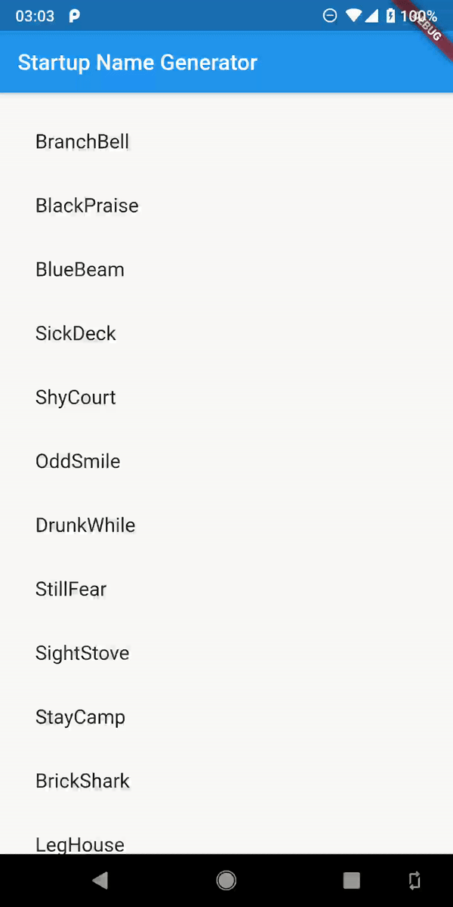

# Loaded List View

Flutter just provide an estimated max scroll extent of the list view. Therefore it might be difficult to directly jump to the bottom of the list view without reversing the list view.

By override a small piece of code can make this possible. The point is that _RenderSliverList_ only stores "usefull" items and this leads to the unprecise estimation of other "unuseful" items. Thus, considering every item as useful will make the estimation precise.

## Example

an example based on official get-started example which will jump to bottom after every pull-up-to-refresh and jump to top after every pull-down-to-refresh.



## Usage

import this repository into the project

```yaml
loaded_list_view:
    git:
      url: git://github.com/DawenZhang/LoadedListView.git
```

then use it somewhere in the code

```Dart
import 'package:loaded_list_view/loaded_list_view.dart';

.
.
.

LoadedListView.separated(
    controller: ,
    itemCount: ,
    separatorBuilder: ,
    itemBuilder: ,
);

.
.
.

_controller.position.maxScrollExtent
```

better use with [DualRefreshIndicator](https://github.com/DawenZhang/DualRefreshIndicator)